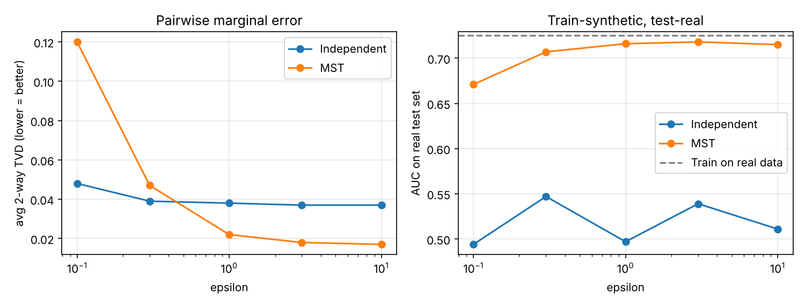

# dpsynth: differentially private synthetic data, built from first principles

[](https://github.com/OWNER/dp-synthetic-data/actions)
 

You can't share many valuable tables (customer records, patient data, employee surveys) because of privacy risk. `dpsynth` produces a **synthetic copy** that keeps the statistical structure analysts and models need. It comes with a **formal differential-privacy guarantee**: whether or not any one person is in the data barely changes what the generator outputs.

The package is about 650 lines of readable NumPy and has no DP framework dependency. Every privacy claim is made explicitly in the code and checked by tests.

```python
from dpsynth import Domain, MSTSynthesizer

domain = Domain.from_json("examples/census_schema.json")   # PUBLIC bounds only
synth  = MSTSynthesizer(epsilon=1.0, delta=1e-6, seed=0).fit(private_df, domain)
fake   = synth.sample(10_000)

print(synth.privacy_report())   # itemised zCDP ledger -> (1.000, 1e-06)-DP
print(synth.describe_tree())    # dependencies it privately discovered
```

## Results

The benchmark uses 20k training rows and 5k held-out real rows, with 3 seeds per point (`python benchmarks/privacy_utility.py`).



| method | ε | 2-way TVD ↓ | TSTR AUC ↑ |
|---|---|---|---|
| Independent baseline | 1.0 | 0.038 | 0.50 |
| **MST (this repo)** | 1.0 | **0.022** | **0.716** |
| **MST (this repo)** | 3.0 | **0.018** | **0.718** |
| Train on real data | n/a | n/a | 0.725 |

**What this shows**

* At ε = 1, a classifier trained **only on synthetic data** reaches 0.716 AUC on real data. Training on the real data itself gives 0.725, so the synthetic data keeps about 99% of the predictive signal.
* The independent baseline matches each column on its own but loses every relationship between columns, so its TSTR AUC is at chance level (0.50).
* **An honest trade-off:** at ε = 0.1, MST's pairwise error is *worse* than the baseline's. MST spreads a tiny budget across three stages, so each measurement gets noisier. Below ε ≈ 0.3, structure learning doesn't pay for itself on this dataset. Knowing where a method breaks down matters as much as the headline number.
* The exact-match rate of synthetic data (0.81) is no higher than the rate for a **real, independent holdout** (0.81). In other words, the generator doesn't reproduce training records any more often than you'd expect by chance in this low-cardinality domain.

## How it works

The algorithm follows **MST** (McKenna, Miklau & Sheldon, 2021), which won the NIST DP Synthetic Data Challenge. The total budget ρ (zCDP) is split into thirds:

```
           ┌──────────────── ρ/3 ────────────────┐┌──────── ρ/3 ────────┐┌──────── ρ/3 ────────┐
 private → │ 1. Gaussian noise on every 1-way    ││ 2. Exponential mech ││ 3. Gaussian noise   │ → noisy
  data     │    marginal (column histogram)      ││    picks d−1 edges  ││    on the chosen    │   tables
           │                                     ││    of a max spanning ││    2-way marginals  │
           └─────────────────────────────────────┘│    tree (Kruskal)   │└─────────────────────┘
                                                  └─────────────────────┘
                              noisy tables → simplex projection → sample root, then children
                              conditioned on parents along the tree   (post-processing: free)
```

1. **Measure 1-way marginals.** Under add/remove neighbours, each histogram has L2 sensitivity 1, so the Gaussian mechanism with σ = 1/√(2ρᵢ) is ρᵢ-zCDP.
2. **Learn the structure privately.** Each pair of columns is scored by how far its true joint distribution is from what independence predicts. The score has sensitivity 1. Edges are then picked one at a time with the exponential mechanism (ε²/8-zCDP, bounded-range analysis), skipping any edge that would form a cycle. On the demo data the learner reliably recovers the planted `education → occupation → income` chain.
3. **Measure the chosen pairs.** These are only d − 1 tables, not d(d−1)/2, which is what makes the method scale.
4. **Post-process.** Noisy counts are projected onto the probability simplex (Duchi et al., 2008), and records are sampled along the tree. By the post-processing property of DP, this step costs no budget.

Composition is tracked in `PrivacyLedger`, which **refuses to overspend**. The final ρ is converted to (ε, δ) with ε = ρ + 2√(ρ log 1/δ).

### Design decisions

| Decision | Why |
|---|---|
| zCDP accounting instead of basic composition | Many Gaussian measurements compose much more tightly, leaving more utility at the same ε |
| Bin edges and categories must come from a **public schema** | Data-derived quantiles leak information. This is a common real-world DP bug |
| Unknown categories map to a fixed fallback | A data-independent rule, so it costs no privacy |
| Simplex projection plus tree sampling instead of Private-PGM | Fewer than 50 lines and dependency-free, at a small utility cost (see roadmap) |

## Quick start

```bash
pip install -e ".[dev,bench]"
pytest -q                                   # 21 tests: accounting, mechanisms, end-to-end
python -m dpsynth --input examples/census_sample.csv \
                  --schema examples/census_schema.json \
                  --epsilon 1.0 --output synth.csv
python benchmarks/privacy_utility.py        # regenerates results/
```

Schema format:

```json
{
  "age":       {"type": "numeric", "lower": 17, "upper": 90, "bins": 15},
  "education": {"type": "categorical", "categories": ["HS", "Bachelors", "Masters"]}
}
```

## Repository layout

```
dpsynth/
  accounting.py    zCDP <-> (ε,δ), Gaussian σ, exponential-mechanism ε, PrivacyLedger
  mechanisms.py    marginals, Gaussian / exponential mechanisms, simplex projection
  domain.py        public schema, discretisation, decoding back to values
  synthesizers.py  IndependentSynthesizer (baseline), MSTSynthesizer
  evaluate.py      k-way TVD, train-synthetic-test-real, exact-match sanity check
  datasets.py      offline census-like generator with known dependency structure
benchmarks/        privacy-utility sweep
tests/             unit + statistical tests
```

## Limitations and roadmap

- [ ] Private-PGM / mirror-descent inference for globally consistent marginals
- [ ] AIM-style adaptive selection of higher-order (3-way) marginals
- [ ] Membership-inference audit to measure empirical privacy leakage against the theoretical ε
- [ ] Benchmarks on UCI Adult and other public datasets
- The demo dataset is synthetic. It was chosen so that tests run offline and the ground-truth structure is known.

## References

- McKenna, Miklau, Sheldon. *Winning the NIST Contest: A scalable and general approach to differentially private synthetic data.* JPC 2021.
- Bun, Steinke. *Concentrated Differential Privacy: Simplifications, Extensions, and Lower Bounds.* TCC 2016.
- Cesar, Rogers. *Bounding, Concentrating, and Truncating: Unifying Privacy Loss Composition for Data Analytics.* ALT 2021.
- Duchi et al. *Efficient Projections onto the ℓ1-Ball for Learning in High Dimensions.* ICML 2008.

---
Author: Mahshad Shariatnasab, PhD. Six peer-reviewed papers in information theory and privacy (IEEE ISIT, JSAIT).
